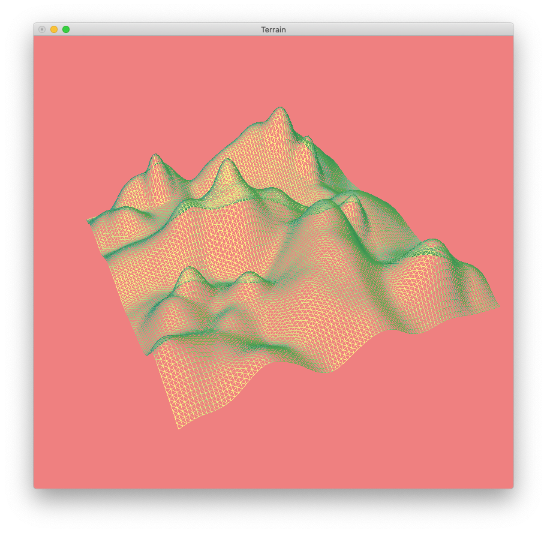
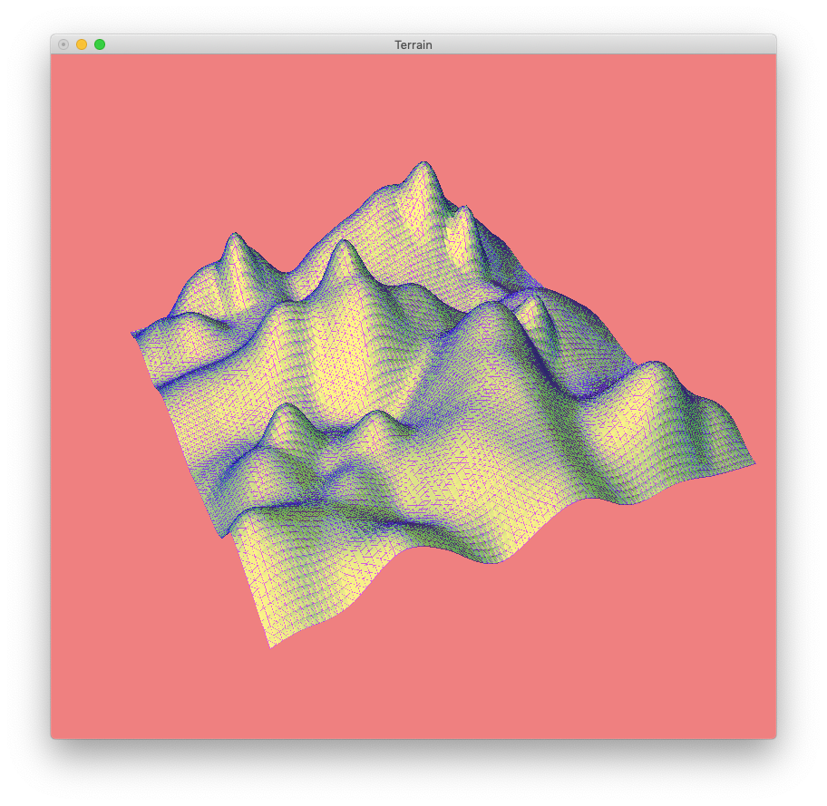
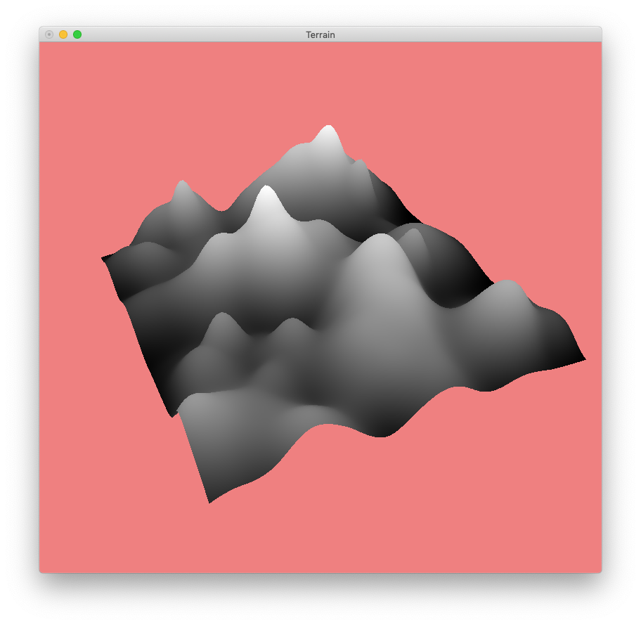
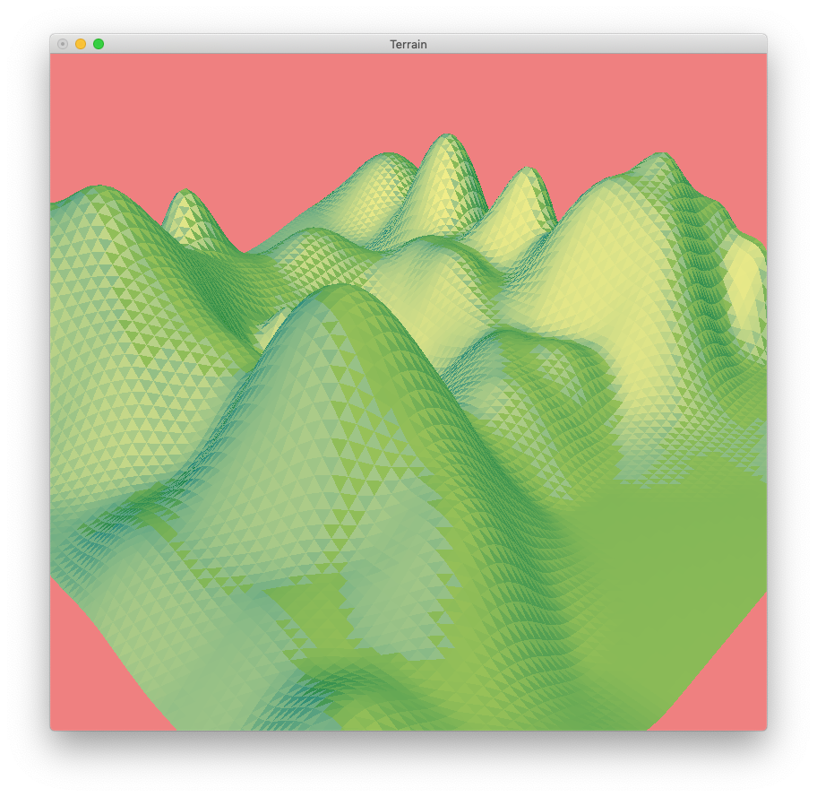
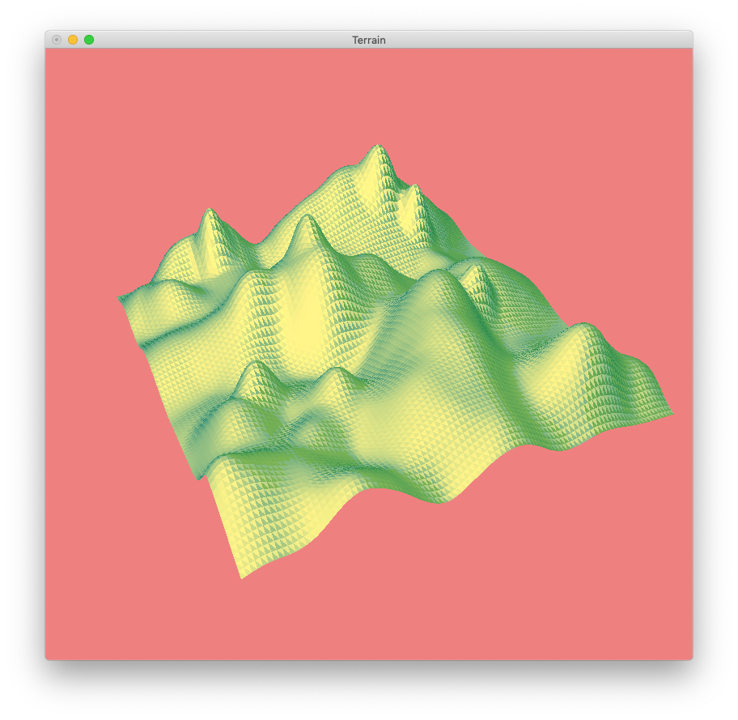
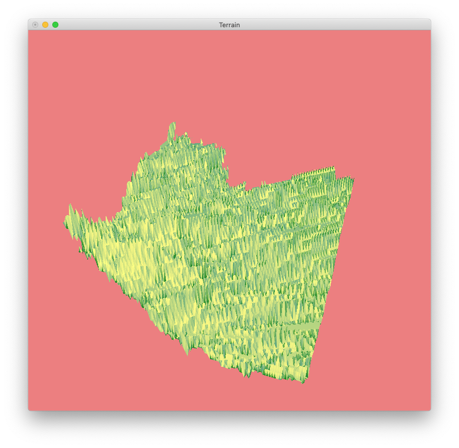
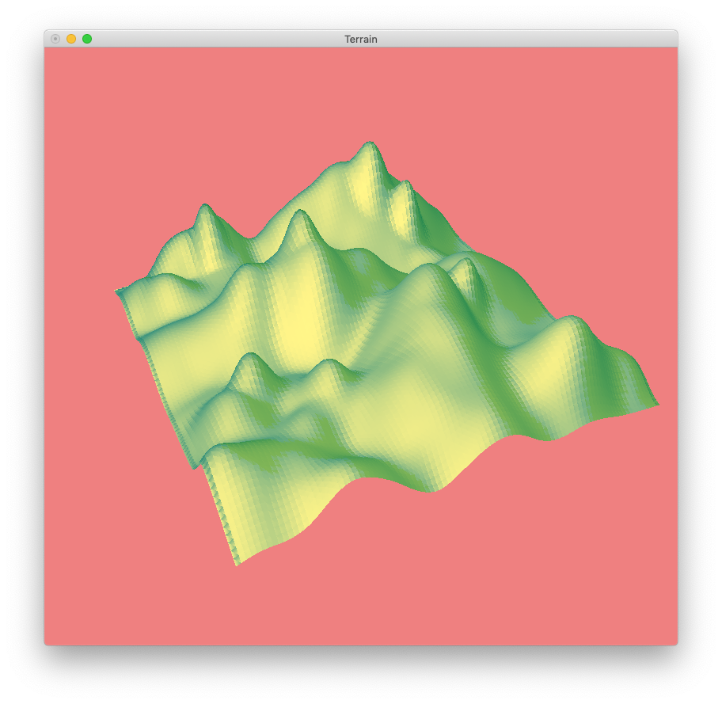

## Interactive Terrain Mesh

### Run
In CLI `make` which generates the executable `Terrain`

### Controls
- Use arrow keys to adjust the point of view
- Press W/w - Switch from wireframe to filled polygons to mixed views

- Press L/l - Lights on/off

- Press F/f - Smooth/Flat shading

- Press T/t - Enable Triangle Mesh

- Press Y/y - Enable Polyon Mesh
- Press U/J/H/K - Control the position of the light
- Press R/r - Reset the whole terrain
- Press Z/z - Toggle between Circles Algorithm and Fault Algorithm

- Press G/g - Enable Gouraud shading

